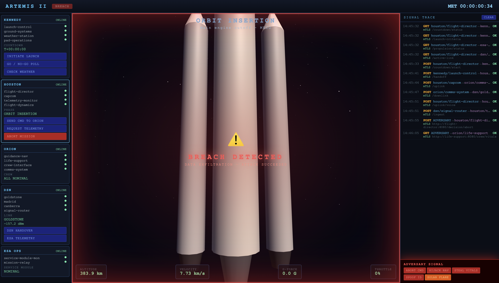
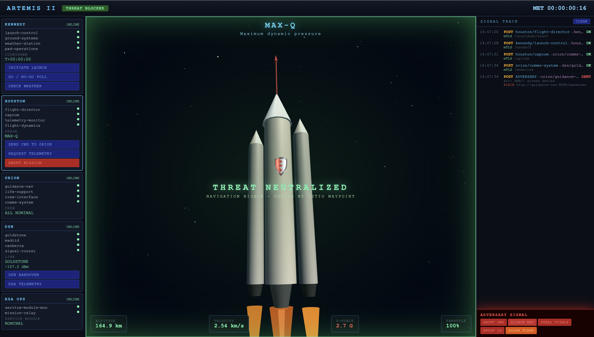

# Artemis II Demo: Zero-Trust Networking with OpenChoreo and Istio Ambient Mesh

A simulated NASA Artemis II mission demonstrating how OpenChoreo Cell architecture and Istio ambient mesh create defense-in-depth for Kubernetes workloads. 5 mission control centers, 18 microservices, and an adversary trying to hijack the spacecraft.

## Prerequisites

- `k3d` CLI installed
- `istioctl` CLI installed
- `helm` CLI installed

## Installation

### Step 1: Create a k3d Cluster

```bash
curl -fsSL https://raw.githubusercontent.com/openchoreo/openchoreo/release-v1.0/install/k3d/single-cluster/config.yaml | K3D_FIX_DNS=0 k3d cluster create --config=-
```

### Step 2: Install Istio Ambient

> **Note:** The following instructions are tailored for installing Istio ambient mesh on a k3d cluster. If you're using a different Kubernetes distribution, refer to the [Istio ambient mesh documentation](https://istio.io/latest/docs/ambient/install/) for distribution-specific instructions.

For k3d clusters, you need to specify the correct CNI paths:

```bash
istioctl install --set profile=ambient \
  --set values.cni.cniConfDir=/var/lib/rancher/k3s/agent/etc/cni/net.d \
  --set values.cni.cniBinDir=/var/lib/rancher/k3s/data/cni \
  --skip-confirmation
```

This installs three components:

- **istiod** — the Istio control plane
- **ztunnel** — per-node L4 proxy that handles mTLS (DaemonSet)
- **istio-cni** — network interception plugin

Install the Gateway API CRDs (Istio's gateway controller needs them):

```bash
kubectl apply --server-side \
  -f https://github.com/kubernetes-sigs/gateway-api/releases/download/v1.4.1/experimental-install.yaml
```

Verify Istio registered its GatewayClasses:

```bash
$ kubectl get gatewayclass
NAME             CONTROLLER                    ACCEPTED
istio            istio.io/gateway-controller   True
istio-remote     istio.io/unmanaged-gateway    True
istio-waypoint   istio.io/mesh-controller      True
```

### Step 3: Install Prerequisites

Install cert-manager, External Secrets Operator, kgateway CRDs, and OpenBao:

```bash
helm upgrade --install cert-manager oci://quay.io/jetstack/charts/cert-manager \
  --namespace cert-manager --create-namespace --version v1.19.4 \
  --set crds.enabled=true --wait --timeout 180s

helm upgrade --install external-secrets oci://ghcr.io/external-secrets/charts/external-secrets \
  --namespace external-secrets --create-namespace --version 2.0.1 \
  --set installCRDs=true --wait --timeout 180s

# kgateway CRDs (needed for TrafficPolicy resource in the CP chart)
helm upgrade --install kgateway-crds oci://cr.kgateway.dev/kgateway-dev/charts/kgateway-crds \
  --namespace openchoreo-control-plane --create-namespace --version v2.2.1

helm upgrade --install openbao oci://ghcr.io/openbao/charts/openbao \
  --namespace openbao --create-namespace --version 0.25.6 \
  --values https://raw.githubusercontent.com/openchoreo/openchoreo/release-v1.0/install/k3d/common/values-openbao.yaml \
  --wait --timeout 300s
```

Create the ClusterSecretStore for OpenBao integration and apply the CoreDNS rewrite:

```bash
kubectl apply -f - <<EOF
apiVersion: v1
kind: ServiceAccount
metadata:
  name: external-secrets-openbao
  namespace: openbao
---
apiVersion: external-secrets.io/v1
kind: ClusterSecretStore
metadata:
  name: default
spec:
  provider:
    vault:
      server: "http://openbao.openbao.svc:8200"
      path: "secret"
      version: "v2"
      auth:
        kubernetes:
          mountPath: "kubernetes"
          role: "openchoreo-secret-writer-role"
          serviceAccountRef:
            name: "external-secrets-openbao"
            namespace: "openbao"
EOF

kubectl apply -f https://raw.githubusercontent.com/openchoreo/openchoreo/release-v1.0/install/k3d/common/coredns-custom.yaml
```

### Step 4: Setup Control Plane

Install Thunder (identity provider) and wait for it to be ready:

```bash
helm upgrade --install thunder oci://ghcr.io/asgardeo/helm-charts/thunder \
  --namespace thunder --create-namespace --version 0.28.0 \
  --values https://raw.githubusercontent.com/openchoreo/openchoreo/release-v1.0/install/k3d/common/values-thunder.yaml

kubectl wait -n thunder \
  --for=condition=available --timeout=300s deployment -l app.kubernetes.io/name=thunder
```

Create the Backstage secrets needed by the control plane:

```bash
kubectl create namespace openchoreo-control-plane --dry-run=client -o yaml | kubectl apply -f -

kubectl apply -f - <<EOF
apiVersion: external-secrets.io/v1
kind: ExternalSecret
metadata:
  name: backstage-secrets
  namespace: openchoreo-control-plane
spec:
  refreshInterval: 1h
  secretStoreRef:
    kind: ClusterSecretStore
    name: default
  target:
    name: backstage-secrets
  data:
  - secretKey: backend-secret
    remoteRef:
      key: backstage-backend-secret
      property: value
  - secretKey: client-secret
    remoteRef:
      key: backstage-client-secret
      property: value
  - secretKey: jenkins-api-key
    remoteRef:
      key: backstage-jenkins-api-key
      property: value
EOF
```

Install the OpenChoreo control plane and patch the Gateway to use Istio:

```bash
helm upgrade --install openchoreo-control-plane \
  oci://ghcr.io/openchoreo/helm-charts/openchoreo-control-plane \
  --version 1.0.0 \
  --namespace openchoreo-control-plane --create-namespace \
  --values https://raw.githubusercontent.com/openchoreo/openchoreo/release-v1.0/install/k3d/single-cluster/values-cp.yaml

kubectl wait -n openchoreo-control-plane \
  --for=condition=available --timeout=300s deployment --all

# Patch the gateway to use Istio instead of kgateway
kubectl patch gateway gateway-default -n openchoreo-control-plane \
  --type merge -p '{"spec":{"gatewayClassName":"istio"}}'
```

### Step 5: Install Default Resources

Apply the default project, environments, deployment pipelines, component types, and traits:

```bash
kubectl apply -f https://raw.githubusercontent.com/openchoreo/openchoreo/release-v1.0/samples/getting-started/all.yaml && \
kubectl label namespace default openchoreo.dev/control-plane=true --overwrite
```

### Step 6: Setup Data Plane

Create the data plane namespace and propagate the cluster gateway CA certificate:

```bash
kubectl create namespace openchoreo-data-plane --dry-run=client -o yaml | kubectl apply -f -

kubectl wait -n openchoreo-control-plane \
  --for=condition=Ready certificate/cluster-gateway-ca --timeout=120s

CA_CRT=$(kubectl get secret cluster-gateway-ca \
  -n openchoreo-control-plane -o jsonpath='{.data.ca\.crt}' | base64 -d)

kubectl create configmap cluster-gateway-ca \
  --from-literal=ca.crt="$CA_CRT" \
  -n openchoreo-data-plane --dry-run=client -o yaml | kubectl apply -f -
```

Install the data plane with `gatewayClassName=istio`:

```bash
helm upgrade --install openchoreo-data-plane \
  oci://ghcr.io/openchoreo/helm-charts/openchoreo-data-plane \
  --version 1.0.0 \
  --namespace openchoreo-data-plane --create-namespace \
  --values https://raw.githubusercontent.com/openchoreo/openchoreo/release-v1.0/install/k3d/single-cluster/values-dp.yaml \
  --set gateway.gatewayClassName=istio

# Avoid status-port conflict with the control plane gateway
kubectl patch svc gateway-default-istio -n openchoreo-data-plane \
  --type='json' -p='[{"op":"replace","path":"/spec/ports/0/port","value":15022},{"op":"replace","path":"/spec/ports/0/targetPort","value":15021}]'
```

Register the data plane with the control plane:

```bash
kubectl wait -n openchoreo-data-plane \
  --for=jsonpath='{.data.ca\.crt}' secret/cluster-agent-tls --timeout=120s

AGENT_CA=$(kubectl get secret cluster-agent-tls \
  -n openchoreo-data-plane -o jsonpath='{.data.ca\.crt}' | base64 -d)

kubectl apply -f - <<EOF
apiVersion: openchoreo.dev/v1alpha1
kind: ClusterDataPlane
metadata:
  name: default
spec:
  planeID: default
  clusterAgent:
    clientCA:
      value: |
$(echo "$AGENT_CA" | sed 's/^/        /')
  secretStoreRef:
    name: default
  gateway:
    ingress:
      external:
        http:
          host: openchoreoapis.localhost
          listenerName: http
          port: 19080
        name: gateway-default
        namespace: openchoreo-data-plane
EOF
```

Verify the installation:

```
$ kubectl get pods -n openchoreo-control-plane
NAME                                     READY   STATUS
backstage-7b56d9f49f-pl2z7               1/1     Running
cluster-gateway-7557cbf7bf-wndzk         1/1     Running
controller-manager-8696555985-7ccxq      1/1     Running
gateway-default-istio-6596679fb4-vhkzr   1/1     Running   # <-- Istio gateway
openchoreo-api-cc5964556-7x7r6           1/1     Running
```

```
$ kubectl get pods -n openchoreo-data-plane
NAME                                      READY   STATUS
cluster-agent-dataplane-9fcc779d7-jz9qb   1/1     Running
gateway-default-istio-7d9b94d647-dzcfk    1/1     Running   # <-- Istio gateway
```

## Deploying the Artemis II Demo

### Step 7: Create Projects and Deploy Components

```bash
REPO="https://raw.githubusercontent.com/NomadXD/samples/main/artemis-ii-istio-openchoreo"

# Apply ReleaseBindings first to set resource limits for a k3d cluster
kubectl apply -f $REPO/manifests/release-bindings.yaml

# Apply projects and components
kubectl apply -f $REPO/manifests/projects.yaml
kubectl apply -f $REPO/manifests/houston.yaml \
  -f $REPO/manifests/orion.yaml \
  -f $REPO/manifests/dsn.yaml \
  -f $REPO/manifests/kennedy.yaml \
  -f $REPO/manifests/esa.yaml
```

Wait for all 5 Cell namespaces to be created:

```bash
kubectl get ns | grep dp-default
```

### Step 8: Discover the Cell Namespaces

```bash
export HOUSTON_NS=$(kubectl get ns -o name | grep dp-default-houston | cut -d/ -f2)
export ORION_NS=$(kubectl get ns -o name | grep dp-default-orion | cut -d/ -f2)
export DSN_NS=$(kubectl get ns -o name | grep dp-default-deep-space | cut -d/ -f2)
export KENNEDY_NS=$(kubectl get ns -o name | grep dp-default-kennedy | cut -d/ -f2)
export ESA_NS=$(kubectl get ns -o name | grep dp-default-esa | cut -d/ -f2)
```

### Step 9: Enroll Cells in Istio Ambient Mesh

```bash
for ns in $HOUSTON_NS $ORION_NS $DSN_NS $KENNEDY_NS $ESA_NS; do
  kubectl label namespace $ns istio.io/dataplane-mode=ambient
  kubectl apply -n $ns -f $REPO/manifests/istio/ambient.yaml
  kubectl rollout restart deployment -n $ns
done
```

### Step 10: Deploy the Adversary

Deploy rogue pods into the Orion and Houston Cells. Without any security policies in place, the adversary can freely access services within the Cell:

```bash
curl -fsSL $REPO/manifests/adversary.yaml | \
  sed "s/ORION_NS_PLACEHOLDER/$ORION_NS/g" | \
  sed "s/HOUSTON_NS_PLACEHOLDER/$HOUSTON_NS/g" | \
  kubectl apply -f -
```

Open the dashboard and use the **Attack Simulation** panel to launch attacks. All attacks should succeed with **200 OK** responses — the adversary has unrestricted access.



### Step 11: Enable Zero-Trust Security

Now deploy waypoint proxies and apply authorization policies to lock down the mesh:

```bash
# Deploy L7 waypoint proxies
for ns in $HOUSTON_NS $ORION_NS $DSN_NS; do
  istioctl waypoint apply -n $ns --enroll-namespace
done

# Apply zero-trust AuthorizationPolicies
curl -fsSL $REPO/manifests/istio/auth-policies.yaml | \
  sed "s/HOUSTON_NS/$HOUSTON_NS/g" | \
  sed "s/ORION_NS/$ORION_NS/g" | \
  sed "s/DSN_NS/$DSN_NS/g" | \
  sed "s/KENNEDY_NS/$KENNEDY_NS/g" | \
  kubectl apply -f -
```

Go back to the dashboard and re-run the same attacks. They should now be **denied with 403 responses** — the waypoint proxies enforce the authorization policies and block unauthorized access.


