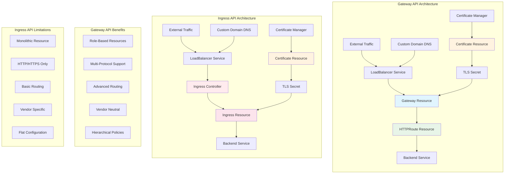
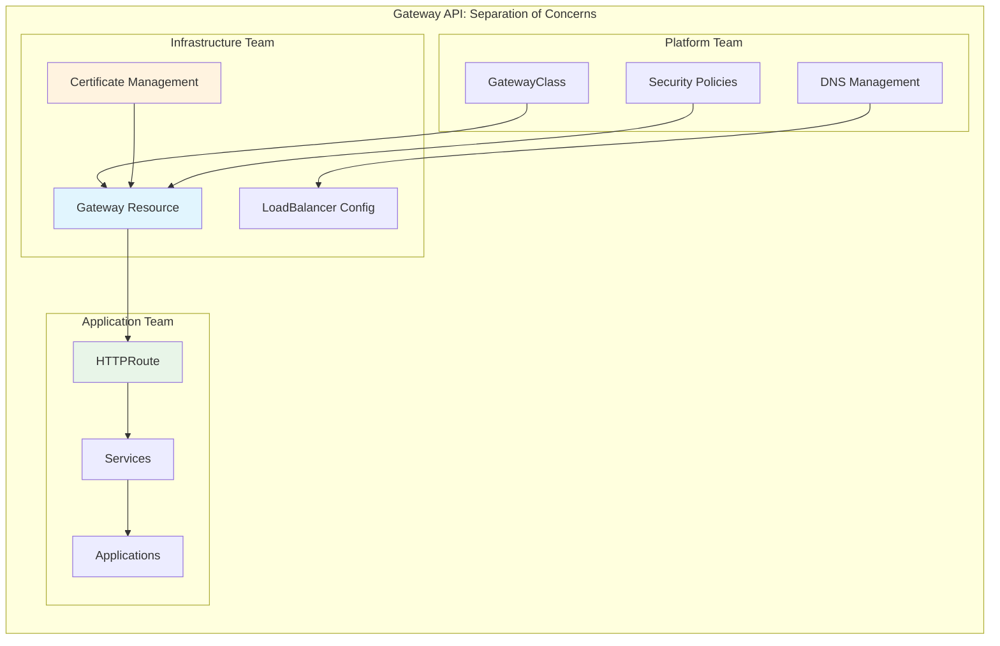
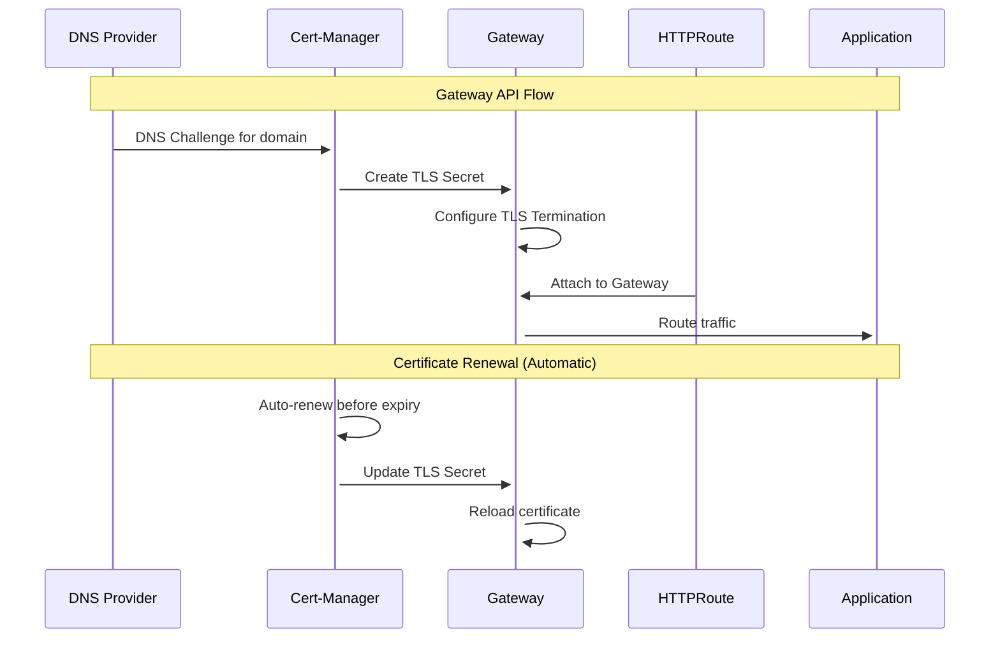
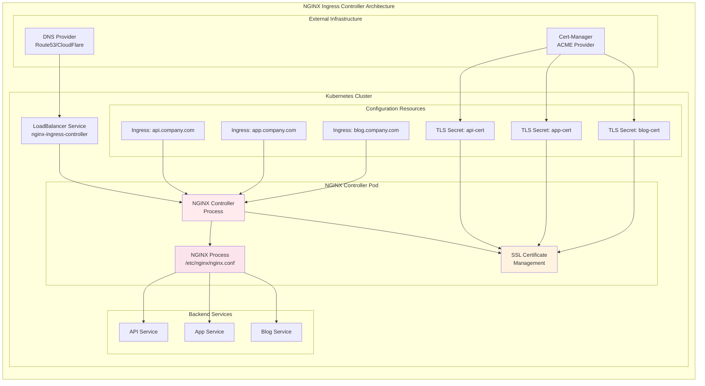
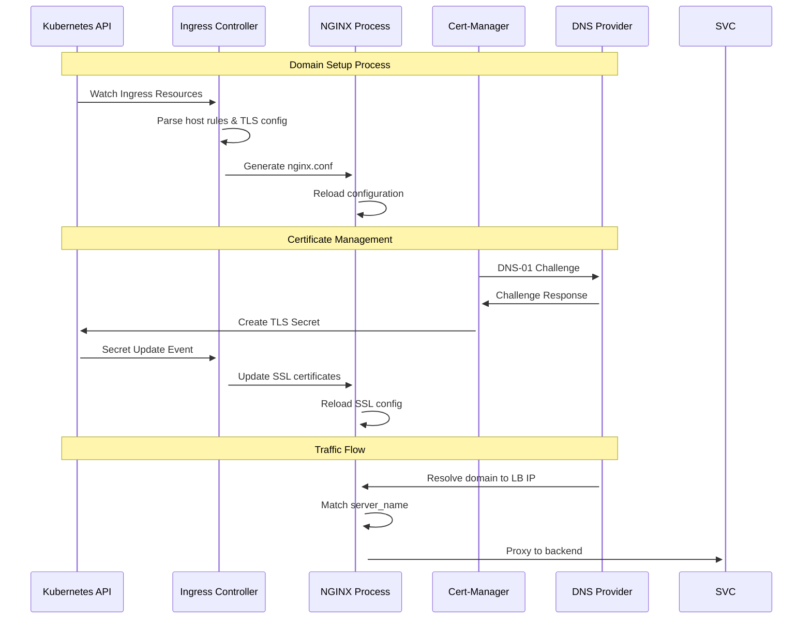
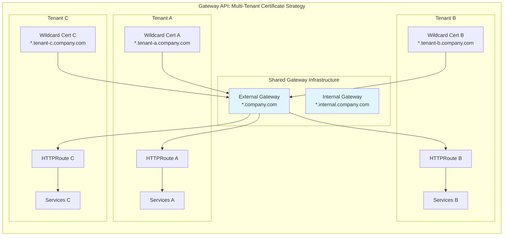

# Gateway API vs Ingress API: Custom Domain & Certificate Management

## Complexity Comparison Diagram



## Detailed Complexity Analysis

### Gateway API Approach



### Certificate & Domain Management Complexity



### NGINX Ingress Controller: Custom Domain Handling



### NGINX Ingress: Configuration Generation Process



### Multi-Tenant Certificate Management



## How NGINX Ingress Controller Handles Custom Domains

### 1. **Configuration Generation Process**

NGINX Ingress Controller works by:

- **Watching Kubernetes API**: Continuously monitors Ingress resources for changes
- **Dynamic Configuration**: Generates NGINX configuration files (`nginx.conf`) based on Ingress rules
- **Hot Reload**: Reloads NGINX process when configuration changes without dropping connections

### 2. **Domain-to-Service Mapping**

```yaml
# Example: Multiple domains in single Ingress
apiVersion: networking.k8s.io/v1
kind: Ingress
metadata:
  name: multi-domain-ingress
  annotations:
    kubernetes.io/ingress.class: nginx
    cert-manager.io/cluster-issuer: letsencrypt-prod
spec:
  tls:
    - hosts: ["api.company.com", "app.company.com"]
      secretName: company-wildcard-cert
  rules:
    - host: api.company.com
      http:
        paths:
          - path: /
            pathType: Prefix
            backend:
              service:
                name: api-service
                port:
                  number: 80
    - host: app.company.com
      http:
        paths:
          - path: /
            pathType: Prefix
            backend:
              service:
                name: app-service
                port:
                  number: 80
```

### 3. **Generated NGINX Configuration**

The controller generates NGINX server blocks like:

```nginx
# Generated nginx.conf snippet
server {
    listen 443 ssl http2;
    server_name api.company.com;

    ssl_certificate /etc/nginx/ssl/company-wildcard-cert.crt;
    ssl_certificate_key /etc/nginx/ssl/company-wildcard-cert.key;

    location / {
        proxy_pass http://api-service.default.svc.cluster.local:80;
        proxy_set_header Host $host;
        proxy_set_header X-Real-IP $remote_addr;
    }
}

server {
    listen 443 ssl http2;
    server_name app.company.com;

    ssl_certificate /etc/nginx/ssl/company-wildcard-cert.crt;
    ssl_certificate_key /etc/nginx/ssl/company-wildcard-cert.key;

    location / {
        proxy_pass http://app-service.default.svc.cluster.local:80;
        proxy_set_header Host $host;
        proxy_set_header X-Real-IP $remote_addr;
    }
}
```

### 4. **Certificate Management Integration**

- **Cert-Manager Integration**: Works with cert-manager for automatic certificate provisioning
- **DNS Challenges**: Supports DNS-01 challenges for wildcard certificates
- **Auto-Renewal**: Certificates are automatically renewed before expiry
- **Secret Watching**: Controller watches TLS secrets and updates NGINX configuration

## Certificate Management: Manual vs Automatic

### **Option 1: Automatic Certificate Creation (Recommended)**

With cert-manager annotations, you don't need to create Certificate resources manually:

```yaml
# Ingress with automatic certificate creation
apiVersion: networking.k8s.io/v1
kind: Ingress
metadata:
  name: auto-cert-ingress
  annotations:
    # This tells cert-manager to automatically create Certificate resource
    cert-manager.io/cluster-issuer: letsencrypt-prod
    # Optional: specify certificate class
    cert-manager.io/issuer-class: nginx
spec:
  tls:
    - hosts:
        - api.company.com
        - app.company.com
      secretName: auto-generated-cert # cert-manager creates this secret
  rules:
    - host: api.company.com
      http:
        paths:
          - path: /
            pathType: Prefix
            backend:
              service:
                name: api-service
                port:
                  number: 80
```

**What happens automatically:**

1. Cert-manager sees the annotation and TLS section
2. **Automatically creates** a Certificate resource
3. **Automatically creates** the TLS secret
4. **Automatically handles** ACME challenges
5. **Automatically renews** certificates

### **Option 2: Manual Certificate Resource Creation**

For more control, you can create Certificate resources manually:

```yaml
# Manual Certificate resource
apiVersion: cert-manager.io/v1
kind: Certificate
metadata:
  name: manual-company-cert
  namespace: default
spec:
  secretName: manual-company-cert-secret
  duration: 2160h # 90 days
  renewBefore: 360h # 15 days before expiry
  subject:
    organizations:
      - company-name
  commonName: api.company.com
  dnsNames:
    - api.company.com
    - app.company.com
    - "*.company.com" # wildcard support
  issuerRef:
    name: letsencrypt-prod
    kind: ClusterIssuer
    group: cert-manager.io
---
# Ingress referencing manually created certificate
apiVersion: networking.k8s.io/v1
kind: Ingress
metadata:
  name: manual-cert-ingress
  # No cert-manager annotations needed
spec:
  tls:
    - hosts:
        - api.company.com
        - app.company.com
      secretName: manual-company-cert-secret # References manually created secret
  rules:
    - host: api.company.com
      # ... rules
```

### **Gateway API Certificate Management**

Gateway API also supports both approaches:

#### **Automatic (with annotations):**

```yaml
apiVersion: gateway.networking.k8s.io/v1
kind: Gateway
metadata:
  name: auto-cert-gateway
  annotations:
    cert-manager.io/cluster-issuer: letsencrypt-prod
spec:
  listeners:
    - name: https
      hostname: api.company.com
      port: 443
      protocol: HTTPS
      tls:
        certificateRefs:
          - name: auto-gateway-cert # cert-manager creates this
```

#### **Manual (with Certificate resource):**

```yaml
# Manual Certificate for Gateway
apiVersion: cert-manager.io/v1
kind: Certificate
metadata:
  name: gateway-company-cert
  namespace: gateway-system
spec:
  secretName: gateway-company-cert-secret
  dnsNames:
    - api.company.com
    - app.company.com
  issuerRef:
    name: letsencrypt-prod
    kind: ClusterIssuer
---
apiVersion: gateway.networking.k8s.io/v1
kind: Gateway
metadata:
  name: manual-cert-gateway
spec:
  listeners:
    - name: https
      hostname: api.company.com
      port: 443
      protocol: HTTPS
      tls:
        certificateRefs:
          - name: gateway-company-cert-secret
```

### **Certificate Management Comparison**

| Approach      | Pros                                                     | Cons                                            | Best For                                           |
| ------------- | -------------------------------------------------------- | ----------------------------------------------- | -------------------------------------------------- |
| **Automatic** | Simple, less YAML, auto-discovery                        | Less control, tied to Ingress/Gateway lifecycle | Development, simple scenarios                      |
| **Manual**    | Full control, reusable across resources, advanced config | More YAML, manual management                    | Production, complex scenarios, shared certificates |

### **Recommendation: Use Automatic for Most Cases**

```yaml
# Simple and effective approach
metadata:
  annotations:
    cert-manager.io/cluster-issuer: letsencrypt-prod
spec:
  tls:
    - hosts: ["your-domain.com"]
      secretName: auto-cert-secret # cert-manager handles everything
```

This automatically creates the Certificate resource and manages the entire lifecycle!

### 5. **Limitations & Challenges**

#### **Resource Proliferation**

```yaml
# Need separate Ingress for each domain/app combination
apiVersion: networking.k8s.io/v1
kind: Ingress
metadata:
  name: tenant-a-api
spec:
  rules:
    - host: api.tenant-a.company.com
      # ... rules
---
apiVersion: networking.k8s.io/v1
kind: Ingress
metadata:
  name: tenant-a-app
spec:
  rules:
    - host: app.tenant-a.company.com
      # ... rules
---
apiVersion: networking.k8s.io/v1
kind: Ingress
metadata:
  name: tenant-b-api
spec:
  rules:
    - host: api.tenant-b.company.com
      # ... rules
```

#### **Annotation Hell**

```yaml
metadata:
  annotations:
    # Basic functionality
    kubernetes.io/ingress.class: nginx
    cert-manager.io/cluster-issuer: letsencrypt-prod

    # Rate limiting (nginx-specific)
    nginx.ingress.kubernetes.io/rate-limit: "100"
    nginx.ingress.kubernetes.io/rate-limit-window: "1m"

    # Auth (nginx-specific)
    nginx.ingress.kubernetes.io/auth-url: "https://auth.company.com"
    nginx.ingress.kubernetes.io/auth-signin: "https://auth.company.com/login"

    # CORS (nginx-specific)
    nginx.ingress.kubernetes.io/enable-cors: "true"
    nginx.ingress.kubernetes.io/cors-allow-origin: "*"

    # Custom headers (nginx-specific)
    nginx.ingress.kubernetes.io/configuration-snippet: |
      more_set_headers "X-Custom-Header: value";
```

### 6. **Operational Complexity**

#### **Configuration Drift**

- NGINX configuration can become complex with many domains
- Debugging requires understanding generated NGINX config
- Performance tuning requires NGINX expertise

#### **Scaling Challenges**

- Single NGINX process handles all domains
- Memory usage grows with number of domains/certificates
- Configuration reload can be slow with many Ingress resources

## Key Differences Summary

| Aspect                     | Gateway API                               | Ingress API                  |
| -------------------------- | ----------------------------------------- | ---------------------------- |
| **Certificate Management** | Attached to Gateway, shared across routes | Per-Ingress resource         |
| **Domain Handling**        | Listener-level configuration              | Rule-level configuration     |
| **Multi-tenancy**          | Role-based separation                     | Namespace isolation only     |
| **Protocol Support**       | HTTP, HTTPS, TCP, UDP, gRPC               | HTTP, HTTPS only             |
| **Routing Complexity**     | Advanced matching, filters, policies      | Basic path/host matching     |
| **Vendor Lock-in**         | Vendor neutral standard                   | Controller-specific features |

## Real-world Example Configuration

### Gateway API Configuration

```yaml
# Gateway with multiple certificates
apiVersion: gateway.networking.k8s.io/v1
kind: Gateway
metadata:
  name: multi-domain-gateway
spec:
  listeners:
    - name: api-domain
      hostname: "api.company.com"
      port: 443
      protocol: HTTPS
      tls:
        certificateRefs:
          - name: api-company-cert
    - name: app-domain
      hostname: "app.company.com"
      port: 443
      protocol: HTTPS
      tls:
        certificateRefs:
          - name: app-company-cert
```

### Ingress API Equivalent

```yaml
# Multiple Ingress resources needed
apiVersion: networking.k8s.io/v1
kind: Ingress
metadata:
  name: api-ingress
spec:
  tls:
    - hosts: ["api.company.com"]
      secretName: api-company-cert
  rules:
    - host: api.company.com
      # ... rules
---
apiVersion: networking.k8s.io/v1
kind: Ingress
metadata:
  name: app-ingress
spec:
  tls:
    - hosts: ["app.company.com"]
      secretName: app-company-cert
  rules:
    - host: app.company.com
      # ... rules
```
